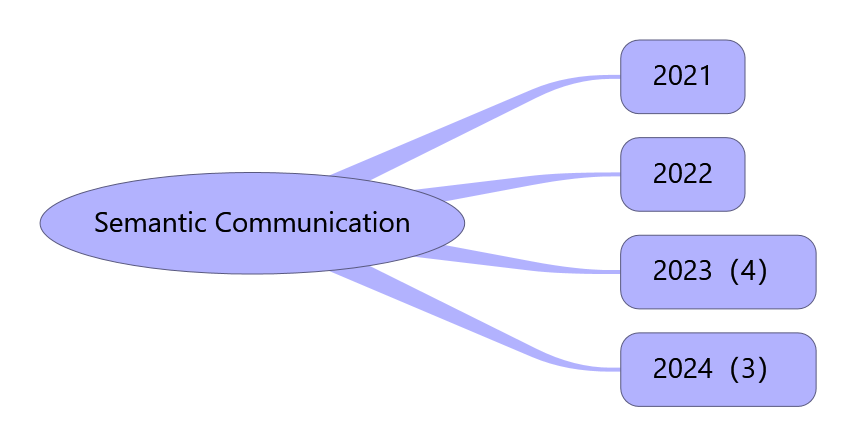

# Papers-in-Semantic-Communication

## OVERVIEW

Papers in semantic communication

## 2021

## 2022

## 2023

1. [On the Role of ViT and CNN in Semantic Communications Analysis and Prototype Validation](https://ieeexplore.ieee.org/document/10171356?denied=) in IEEE
2. [Advances and challenges in semantic communications：A systematic review](https://pdfs.semanticscholar.org/b059/206f9c531a2c038da570a35b06e41bff9e84.pdf?_gl=1*1q06e5u*_gcl_au*NzIwMDA0MzA4LjE3MTcwNTMxMjQ.*_ga*NzE2MzQwMzE2LjE3MTcwNTMxMjM.*_ga_H7P4ZT52H5*MTcyNDQ4NTg3NS40My4xLjE3MjQ0ODU5NTEuNDguMC4w) in National Science Open

## 2024

